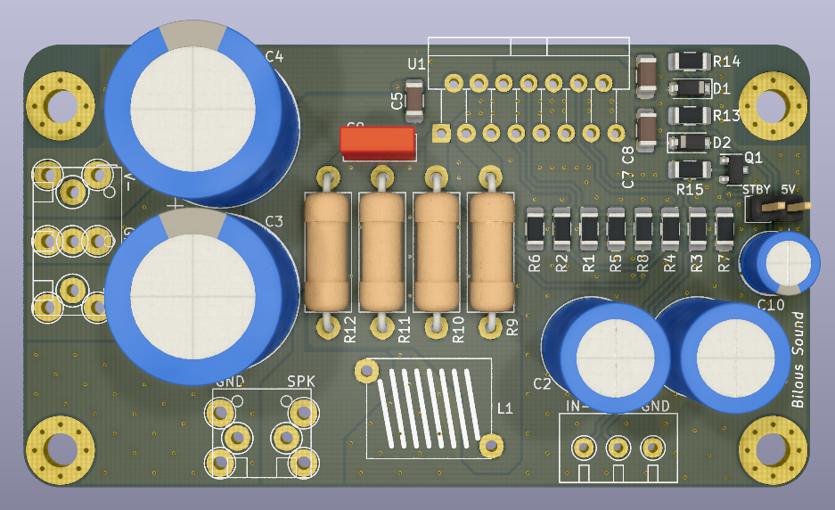
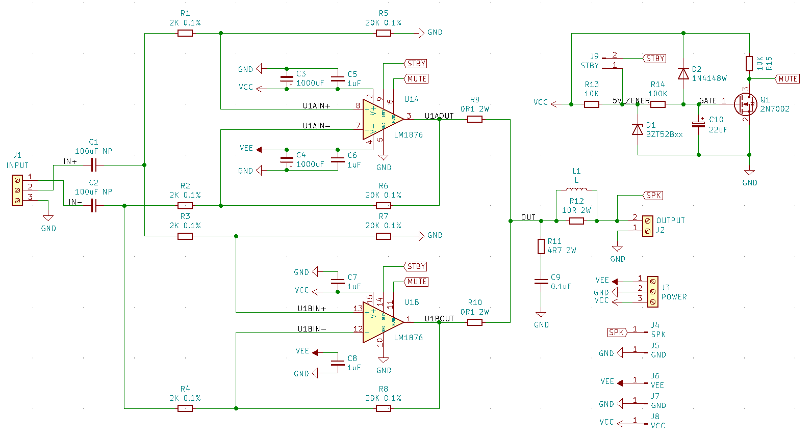
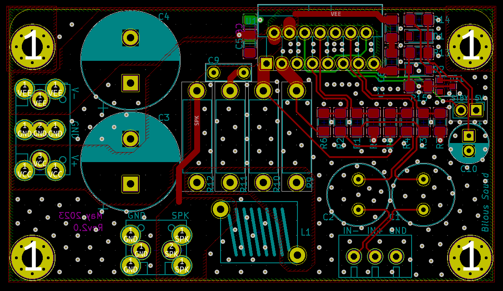

# LM1876x2_bal

LM1876 Overture Series amplifier with two paralleled integrated channels, balanced inputs, and THT/SMD components. Created using KiCad v5.

Benefits of using two chips in parallel include: 
- increase of the output drive capability of an amplifier (higher output current drive), 
- reduced voltage noise (better SNR), 
- and reduced output offset error.

Resources used to design this amp: 
official TI datasheet - [https://www.ti.com/lit/ds/symlink/lm1876.pdf](https://www.ti.com/lit/ds/symlink/lm1876.pdf)

## PCB rendered in 3d:

# Schematics notes:

This is balanced (or differential) implementation of the amplifier. Meaning, you will need to supply IN+ and IN- in addition to the GND for the input signal.
Each channel acts as a difference amplifier providing CMRR performance from the datasheet and limited by the precision of the feedback resistors - 0.1% resistors will give max theoretical CMRR of 66dB.
Inputs are DC coupled with 100u capacitors and form HP filter with R1||R2=1K giving fc=1.59Hz.
Power supply decoupling capacitors are sized according to the datasheet. Two small ceramic X7R type caps of 1uF or 2uF are located close to ICs pins. Two bigger caps are 1000uF aluminum electrolytic and located within close proximity of the IC. 

Because input resistance is 1K you will need to provide some sort of impedance matching to be able to interface from other devices. I have a few buffer designs on my GitHub.

The overall gain is configured to be 10V/V or 20dB. This is a minimum gain recommended by the datasheet and allows designer greater flexibility in choosing the previous stage.

Recommended power supply is dual 25V supply supplying 4A for one channel.

Schematics is below:

# PCB notes:

All elements are THT type.

